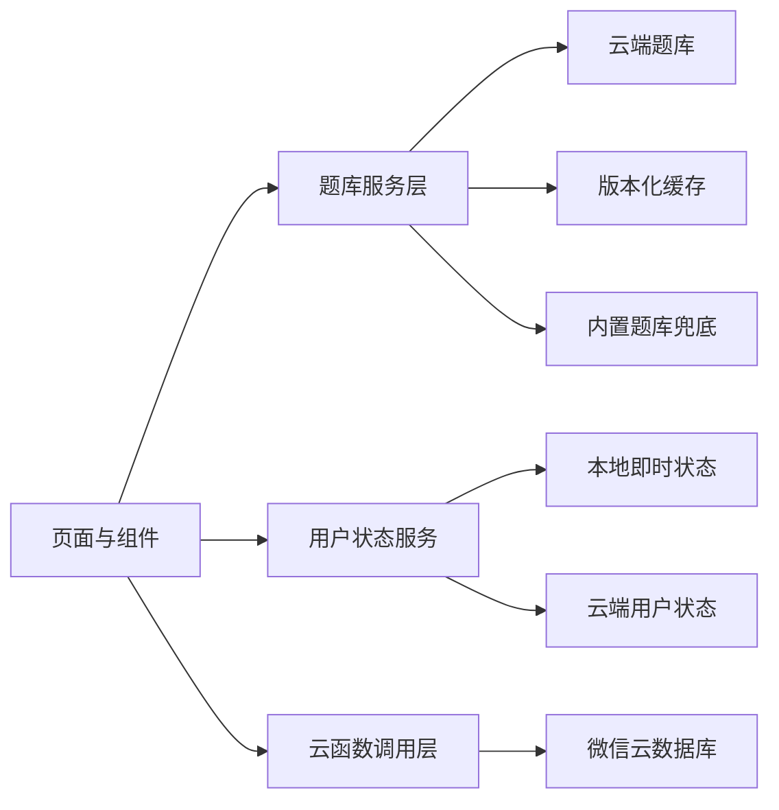

# 前端面面：AI 工程实践作品证据

这份目录用于展示我如何使用 AI 完成架构设计、根因分析、测试生成与工程验收，而不是仅展示 AI 生成的页面代码。

## 项目概览

前端面面是一个基于 Taro、Vue 3、Three.js 和微信云开发实现的前端学习小程序，包含：

- 可交互知识宇宙首页
- 分类题库、搜索、筛选与随机练习
- Markdown 题目解析
- 收藏、掌握状态与练习记录
- 成长中心与可视化实验室
- 云端题库、本地缓存和离线兜底
- 微信 CI 预览与页面自动化检查

## 我希望证明的能力

| 能力 | 证据 |
|---|---|
| AI 辅助架构设计 | [架构案例](./architecture-case-study.md)、[ADR](./adr/) |
| Bug 根因分析 | [旧缓存覆盖 Markdown 的根因复盘](./root-cause-analysis.md) |
| AI 辅助测试生成 | [测试策略与用例设计](./testing-strategy.md)、`tests/` |
| 工程验收 | `scripts/mp-page-check.cjs`、`scripts/mp-probe.cjs` |
| 数据质量治理 | `scripts/validate-question-bank.cjs` |
| 可复用流程沉淀 | `wechat-miniprogram-check` Skill |

## 核心架构



架构重点不是组件数量，而是将三类数据拆开：

1. 题目正文：题干、Markdown、标签、难度。
2. 用户状态：收藏、已掌握、待复习。
3. 行为记录：查看、展开解析、每日挑战、实验记录。

## 可执行证据

运行全部本地作品验证：

```bash
pnpm portfolio:verify
```

该命令依次执行：

```text
9 个核心单元测试
-> 题库与 seed 数据质量校验
-> Taro 微信小程序构建
```

微信运行时验证：

```bash
pnpm mp:preview
pnpm mp:page-check
```

页面检查支持：

- 打开指定小程序页面
- 自动点击指定选择器
- 断言元素和文本
- 截图
- 非白屏像素检测
- 收集运行时异常

## 推荐阅读顺序

1. [架构案例](./architecture-case-study.md)
2. [Bug 根因复盘](./root-cause-analysis.md)
3. [测试策略](./testing-strategy.md)
4. [5 分钟面试演示](./interview-demo.md)
5. [架构决策记录](./adr/)

## 我的 AI 使用原则

```text
先定义问题和约束
-> 让 AI 枚举方案或生成初版
-> 人工审查边界和失败模式
-> 用测试、构建和运行时探针验证
-> 将有效方法沉淀为脚本、文档或 Skill
```

AI 提高了实现和探索速度，但最终技术决策、验收标准和结果责任由我承担。
