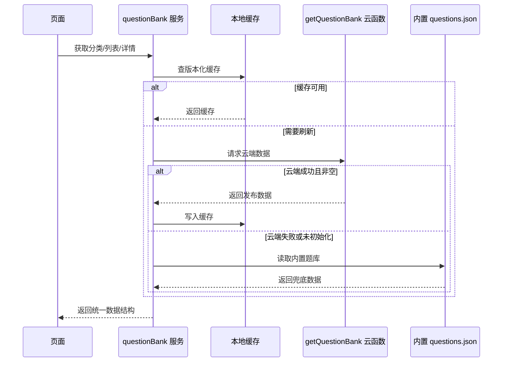

# AI 辅助架构设计案例：题库云化

## 1. 背景

项目初期使用 `questions.json` 保存题目正文、收藏状态和掌握状态。这种结构在 MVP 阶段简单，但题库扩大后出现了三个问题：

- 修改题目需要重新发布小程序。
- 内容与用户状态混合，升级题库可能覆盖收藏和掌握记录。
- 后续 Markdown 编辑后台无法直接接入页面。

## 2. 设计约束

我先向 AI 明确约束，而不是直接让它“重构题库”：

- 云函数未部署、弱网或数据库为空时，页面不能空白。
- 历史数字 ID 和新版字符串 ID 必须兼容。
- 旧用户的收藏与掌握状态不能丢失。
- 页面不能依赖具体数据来源。
- 后续管理后台可以发布 Markdown 答案。
- 小程序包体积和运行环境有限。

## 3. 方案比较

| 方案 | 优点 | 风险 | 结论 |
|---|---|---|---|
| 全部保留本地 JSON | 简单、离线可用 | 内容更新必须发版 | 不满足长期需求 |
| 页面直接读取云数据库 | 实现快 | 页面与数据源耦合，失败时容易空白 | 不采用 |
| 云端优先 + 服务层 + 本地兜底 | 可动态更新、可降级、页面稳定 | 服务层和缓存策略更复杂 | 最终采用 |

AI 用于补充方案、风险和迁移步骤，我负责根据项目约束做最终取舍。

## 4. 最终架构



对应代码：

- `src/services/questionBank.js`
- `src/domain/questionBankCore.cjs`
- `cloudfunctions/getQuestionBank/index.js`
- `scripts/build-question-bank-seed.cjs`

## 5. 数据边界

### 题目正文

```text
id
title/question
categoryId
difficulty
tags
answerMarkdown
assets
updatedAt
```

### 用户状态

```text
questionId
isFavorited
mastery
updatedAt
```

### 学习行为

```text
questionId
action
mode
createdAt
```

这个边界直接解决了题库升级覆盖用户状态的问题。

## 6. AI 参与方式

AI 参与了：

- 搜索受影响页面和云函数。
- 枚举迁移风险。
- 生成服务层和云函数初版。
- 根据失败结果修正缓存、ID 和分页边界。
- 生成测试矩阵和文档初版。

我负责：

- 定义数据所有权。
- 选择降级策略。
- 决定旧状态只继承哪些字段。
- 判断哪些错误属于代码、环境或微信平台。
- 设计验收证据并决定是否完成。

## 7. 架构结果

- 页面统一通过服务层读取题库。
- 云端失败或数据为空时自动使用本地题库。
- 数字 ID 与字符串稳定 ID 可以匹配。
- 缓存按题库版本失效。
- 后台未来只需接入现有云端数据结构。
- 核心归一化和状态合并逻辑已有单元测试。

## 8. 面试总结

> 我使用 AI 不是跳过架构设计，而是加速方案枚举和实现。我先定义数据边界、失败模式和兼容约束，再让 AI 协助落地，最后通过测试与运行时证据验证方案。
