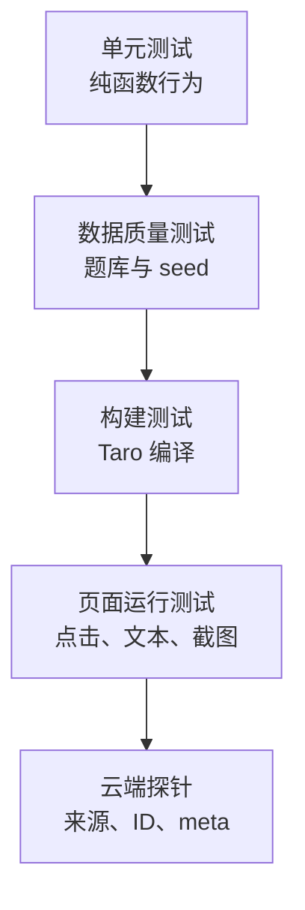

# AI 辅助测试生成策略

## 1. 测试目标

我没有让 AI 根据函数实现机械生成测试，而是先定义必须长期成立的行为契约：

- 新旧题库字段必须归一化为同一结构。
- 数字 ID 与字符串 ID 必须兼容。
- 旧缓存不能覆盖新版题目正文。
- 收藏和掌握状态在题库升级后必须保留。
- 无效题目必须被过滤。
- Markdown 常用结构必须稳定解析。

## 2. 测试分层



### 单元测试

技术：Node.js 内置 `node:test`。

优点：

- 不增加额外测试框架依赖。
- 可直接测试生产模块。
- 运行速度快，适合面试现场演示。

覆盖文件：

- `tests/question-bank-core.test.cjs`
- `tests/markdown-core.test.cjs`

### 数据质量测试

`scripts/validate-question-bank.cjs` 检查：

- ID 唯一性
- 分类合法性
- 题干与答案完整性
- Markdown 样板数量
- seed 数量和格式
- 微信导入 JSON Lines 可解析性

### 构建测试

```bash
pnpm build:weapp
```

用于验证 Vue 模板、Taro 编译和小程序产物。

### 页面运行测试

`scripts/mp-page-check.cjs` 支持：

- 页面打开
- 自动点击
- 元素断言
- 文本断言
- 截图
- 非白屏检测
- 运行时异常收集

### 云端探针

`scripts/mp-probe.cjs` 用于读取页面数据和缓存，证明页面实际使用了云端数据，而不是只走本地兜底。

## 3. AI 生成测试的流程

1. 我先写行为契约与失败案例。
2. 让 AI 补充边界测试矩阵。
3. AI 生成测试初版。
4. 人工检查断言是否验证行为，而非复制实现。
5. 主动构造错误实现，确认测试能够失败。
6. 修复后运行全部回归。

核心原则：

> 测试如果不能在错误实现上失败，就不能证明正确实现受到保护。

## 4. 当前测试覆盖

共 9 个核心单元测试：

| 类别 | 场景 |
|---|---|
| 数据归一化 | 云端与旧字段统一 |
| ID 兼容 | 数字与字符串 ID |
| 异常数据 | 缺 ID 或题干 |
| 缓存模型 | 新正文 + 旧用户状态 |
| 云端状态 | 收藏与掌握合并 |
| 不变性 | 无匹配状态不改原对象 |
| Markdown | 标题、列表、代码、表格、图片 |
| 行内语法 | 加粗、行内代码、链接 |
| 输入兼容 | Windows 换行和空行 |

## 5. 一键验证

```bash
pnpm portfolio:verify
```

当前验证结果：

```text
Unit tests: 9 passed
Question bank: 20 questions
Markdown samples: 5
Seed categories: 9
Seed questions: 20
Taro weapp build: passed
```

## 6. 后续测试计划

- 云函数输入校验与错误返回测试
- `getQuestionBank` 分页和旧 ID 查询测试
- 缓存版本变化清理测试
- 用户状态同步失败后的重试测试
- Three.js 实验状态机测试
- 在 CI 中自动执行 `portfolio:verify`
